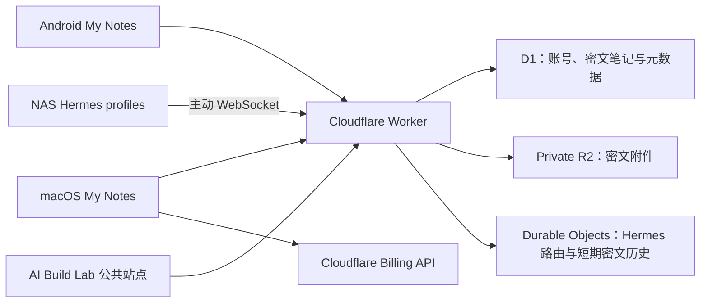

# My Notes 移动办公与 AI 工作区

这是个人主要的移动办公与 AI 工具集成目录。仓库以 **My Notes** 原生客户端为入口，把端到端加密笔记、Hermes AI 助手、Cloudflare 云中继与账单观察整合在同一套 macOS / Android 工作流中；同时保留 AI Build Lab 公共站点和浏览器端小工具。

这已经不再是一个单纯的个人博客项目。当前代码包含两个原生客户端、Cloudflare Worker 后端、NAS 端 Hermes 插件、数据迁移、公共静态站点和跨端一致性测试。

## 当前能力

### My Notes 原生客户端

- macOS 与 Android 共用同一套账号、加密笔记、文件夹、排序、搜索、回收站和乐观并发协议。
- 笔记标题、正文、文件夹名和附件元数据由客户端加密后再上传；搜索在本机解密后完成。
- 支持独立的笔记保护密码、加密附件缓存和跨端一致的密文格式；Android 另外提供照片与录音快速采集。
- Android 面向 Android 16 / API 36；macOS 客户端支持 macOS 14 及以上版本。

### Hermes AI 助手

- Android、macOS 与家庭 NAS 上的多个 Hermes profile 通过 Cloudflare 建立双向加密聊天。
- NAS 只需主动建立出站连接，不需要开放家庭网络公网入站端口。
- 支持多 profile、跨设备同步、流式回复、断线续传、本地加密历史、Markdown、命令面板、审批/澄清交互和加密附件。
- 原生端按 profile 保存独立密钥；Cloudflare 只处理密文、路由信息和有限保留期内的恢复数据。

### Cloudflare 管理与公共站点

- macOS 客户端可直接读取 Cloudflare Billable Usage API，汇总账期费用、产品用量，并提供预算与每日提醒。
- Worker 承担身份认证、设备令牌、工作区密钥、加密笔记、私有 R2 附件和 Hermes Durable Object 中继。
- `superstar1014.qzz.io` 继续提供 AI Build Lab 首页、JSON 格式化、密码生成和小游戏；私有笔记与聊天没有 Web 入口。

## 系统结构



两个自定义域名各有明确职责：

- `superstar1014.qzz.io`：公共站点与原生客户端 HTTPS API。
- `h.superstar1014.qzz.io`：Hermes WebSocket、中继消息和附件通道。

## 目录地图

| 路径 | 职责 |
| --- | --- |
| `android/MyNotes/` | Android 16 原生客户端，Java 17 + OkHttp |
| `macos/AIBuildNotes/` | macOS 14+ SwiftUI 客户端与 `NotesCore` |
| `src/` | Worker 路由、认证、加密笔记仓储与 Hermes Durable Objects |
| `integrations/hermes-cloudflare-chat/` | 部署到 NAS 各 Hermes profile 的 Python 插件 |
| `migrations/` | D1 账号、笔记、文件夹、附件与设备令牌迁移 |
| `public/` | AI Build Lab 静态站点、工具和小游戏 |
| `tests/` | Worker、静态站点、安全协议和跨端能力契约测试 |
| `scripts/` | 密码散列与 macOS App 打包脚本 |
| `docs/` | 架构、部署手册、能力契约和历史资料 |

文档入口见 [`docs/README.md`](docs/README.md)。Hermes 的完整拓扑、NAS 多 profile 配置、密钥变量、清理与回滚步骤见 [`docs/hermes-cloudflare-chat.md`](docs/hermes-cloudflare-chat.md)。

## 安全边界

- 不要把 `.dev.vars`、Cloudflare API Token、Hermes agent secret、任何 profile 聊天密钥或生产环境配置提交到仓库。
- Android 使用 Keystore 保护设备令牌和 Hermes profile 密钥；macOS 使用 Keychain 保存 Hermes 密钥与 Cloudflare Billing Read Token。
- `SESSION_SECRET` 只负责会话签名；`NOTES_KEY_ENCRYPTION_SECRET` 用于包装笔记数据密钥。丢失前者会让现有会话失效，丢失后者且没有安全重包装/备份会使已有笔记无法恢复。
- 笔记和 Hermes 使用不同的加密域。每个 Hermes profile 必须使用独立的 32 字节 `HERMES_CF_CHAT_KEY`。
- `notes` R2 bucket 必须保持私有，不得启用 `r2.dev` 或公共自定义域名。
- macOS Cloudflare 报表直接访问 Cloudflare 官方 API；应只创建具有 `Billing Read` 权限的最小权限 Token。

## 本地开发

首次安装 Worker 依赖：

```bash
npm install
```

运行 Worker 与仓库级检查：

```bash
npm test
npm run check
npm run dev
```

`npm run dev` 默认在 `http://localhost:8787` 启动 Wrangler；`npm run check` 会运行 Node 测试并执行 Wrangler dry-run。

### macOS

```bash
swift test --package-path macos/AIBuildNotes
/bin/zsh scripts/build-macos-app.sh
```

release App 会输出到 `output/My Notes.app`。传入 `debug` 可生成 `output/My Notes Preview.app`。构建脚本会生成完整 `.icns`、执行 ad-hoc 签名并验证 App bundle。

### Android

```bash
cd android/MyNotes
./gradlew assembleDebug
```

APK 输出到 `android/MyNotes/app/build/outputs/apk/debug/app-debug.apk`。本机未配置 Android SDK 时，先设置：

```bash
export ANDROID_HOME=/Users/star/Library/Android/sdk
```

### Hermes 插件

```bash
python3 -m venv /private/tmp/myblog-hermes-venv
/private/tmp/myblog-hermes-venv/bin/python -m pip install \
  -r integrations/hermes-cloudflare-chat/cloudflare_chat/requirements.txt
PYTHONPATH=integrations/hermes-cloudflare-chat \
  /private/tmp/myblog-hermes-venv/bin/python -m unittest discover \
  -s integrations/hermes-cloudflare-chat/tests
```

插件部署位置、默认/命名 profile 的 `.env` 和升级顺序见 [Hermes 部署手册](docs/hermes-cloudflare-chat.md)。

## Cloudflare 初始化与部署

当前 Worker 名为 `wispy-cloud-0978`，资源绑定定义在 `wrangler.jsonc`。新环境需要先创建或确认 D1、应用迁移并设置三个必需 secret：

```bash
npx wrangler d1 create superstar1014-blog
npx wrangler d1 migrations apply superstar1014-blog --remote
npx wrangler secret put SESSION_SECRET
npx wrangler secret put NOTES_KEY_ENCRYPTION_SECRET
npx wrangler secret put HERMES_CHAT_AGENT_SECRET
```

最后执行：

```bash
npm run check
npm run deploy
```

迁移 `0006_delete_legacy_blog_content.sql` 会永久删除旧博客内容；迁移 `0007_recoverable_notes_key.sql` 会替换旧的主密码关系并移除已退役的密码库表。不要在未确认目标环境数据状态时单独重放或改写历史迁移。

## 维护约定

- Hermes 新功能只有在 Android、macOS、[`docs/hermes-native-client-capabilities.json`](docs/hermes-native-client-capabilities.json) 和仓库级 parity tests 同步更新后才算完成。
- 修改密文结构、AAD、revision、缓存键或 profile id 前必须先设计兼容迁移；这些标识可能已绑定现有生产数据。
- 修改 CSS 或 JavaScript 时使用新的指纹文件名，并同步更新引用页面。
- 文档描述以当前代码和可执行检查为准；规划中的功能必须明确标为规划，不能写进“当前能力”。
- 生产 secret、设备密钥、API Token 和本地生成产物始终留在仓库之外。
