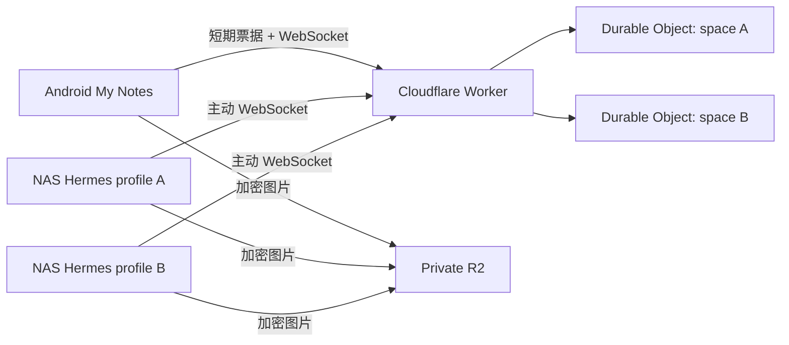

# Hermes Cloudflare Chat 技术方案与部署手册

## 方案结论

家庭 NAS 不开放公网入站端口。每个 Hermes profile 启动自己的 Gateway 和
`cloudflare_chat` 插件，由插件主动连接
`wss://h.superstar1014.qzz.io/api/hermes-chat/ws`。安卓记事本登录现有账号后，
动态读取可用 profile。当前 Android 界面只显示列表中的第一个聊天对象，协议和
Worker 仍保留多 profile 能力，后续恢复切换界面时不需要修改后端数据模型。



profile 数量不写死。Worker 从 `HERMES_CHAT_PROFILES` 读取列表，安卓端从 API
动态读取配置。当前实现最多接受 32 个 profile，目的是防止错误配置无限创建
Durable Object。Android 暂时只进入第一个 profile，但独立密钥、票据和 space
结构均已预留。

## 隔离与安全模型

- 每个 profile id 确定性映射到一个 `space:<profileId>` Durable Object，聊天序号、
  离线记录和连接完全隔离。
- 每个 profile 必须使用不同的 32 字节 `HERMES_CF_CHAT_KEY`。文字与图片均由
  Android/NAS 使用 AES-256-GCM 加密，Cloudflare 只保存密文和路由所需元数据。
- NAS profile 可以共用一个 `HERMES_CHAT_AGENT_SECRET` 做 Worker 身份认证；该
  secret 不参与消息加密。
- Android 使用现有登录会话换取 90 秒、单次使用、绑定 profile 的 WebSocket
  票据，长期设备令牌不会放进 WebSocket URL。
- 图片明文上限为 10 MiB。WebSocket 只发送加密描述符，密文二进制放入现有私有
  R2 bucket 的 `hermes-chat/v1/<profileId>/` 前缀。
- Durable Object 保存最近 500 条加密消息；断线重连按序号补发，每批最多 100 条。

## 流式回复

Hermes v0.20.1 的 Gateway 会先调用平台适配器 `send()` 创建一条回复，再反复调用
`edit_message(..., finalize=...)` 更新该回复。插件使用首次发送获得的 relay 序号作为
替换目标：中间更新只经 WebSocket 实时广播，不写入 500 条历史；最终更新才持久化，
因此重连仍可恢复完整文本。

更新正文、目标序号与完成标志都在 AES-GCM 密文中；外层只保留 Durable Object
路由所需的目标序号和完成标志。Android 解密后会交叉校验两份元数据，再原地更新
同一个消息气泡。若很旧的原消息已超过保留范围，重放最终更新时会退化为显示一条
完整回复，不会丢失内容。

## Cloudflare 配置

在 `wrangler.jsonc` 中配置所有聊天对象，格式为逗号分隔的 `id:显示名`：

```json
{
  "vars": {
    "HERMES_CHAT_PROFILES": "primary:Hermes 主助手,secondary:Hermes 第二助手,research:研究助手"
  }
}
```

要求：id 只能包含小写字母、数字、下划线和连字符，最长 64 字符；显示名最长
40 字符；id 发布并产生聊天记录后不要改名。显示名可以随时修改。

首次发布前执行：

```bash
npx wrangler secret put HERMES_CHAT_AGENT_SECRET
npm test
npx wrangler deploy --dry-run
npx wrangler deploy
```

`wrangler.jsonc` 已把 `h.superstar1014.qzz.io` 声明为 Custom Domain。若该主机名
已有 CNAME，需要先在 Cloudflare DNS 中确认并移除冲突记录；Custom Domain 会由
Cloudflare 创建 DNS 记录和证书。

## NAS 多 profile 部署

先查看实际 profile 名称：

```bash
hermes profile list
```

默认 profile 的插件目录：

```text
/root/.hermes/plugins/cloudflare_chat
```

命名 profile（示例 `research`）的插件目录：

```text
/root/.hermes/profiles/research/plugins/cloudflare_chat
```

把仓库 `integrations/hermes-cloudflare-chat/cloudflare_chat/` 的完整内容复制到每个
需要聊天能力的 profile。将 `requirements.txt` 安装到运行 `hermes` 的同一个
Python/虚拟环境中；不要在插件目录保存 secret。

默认 profile 的 `/root/.hermes/.env` 示例：

```dotenv
HERMES_CF_RELAY_URL=wss://h.superstar1014.qzz.io/api/hermes-chat/ws
HERMES_CF_AGENT_SECRET=<与 Wrangler Secret 相同>
HERMES_CF_SPACE_ID=primary
HERMES_CF_CHAT_KEY=<Android 中 primary 对象生成的密钥>
HERMES_CF_AGENT_ID=nas-primary
HERMES_CF_ALLOWED_USERS=android-owner
HERMES_CF_ALLOW_ALL_USERS=false
```

命名 profile 的 `/root/.hermes/profiles/research/.env` 使用相同 relay/agent secret，
但必须改为自己的 `HERMES_CF_SPACE_ID`、`HERMES_CF_CHAT_KEY` 和 agent id。

重启并检查每个 Gateway：

```bash
hermes gateway restart
hermes -p research gateway restart
hermes status
hermes -p research status
```

## Android 使用流程

1. 登录 My Notes，打开顶部聊天按钮。
2. 客户端从 Worker 读取 profile 列表；当前选择第一个聊天对象。
3. 首次进入每个对象时分别生成聊天密钥。
4. 把界面显示的 `HERMES_CF_SPACE_ID` 和密钥写入对应 NAS profile 的 `.env`。
5. 重启对应 Gateway 后发送文字或图片验证。

Android Keystore 按 profile id 独立保护密钥。后续恢复多对象切换界面时，切换聊天
对象会关闭旧 WebSocket、清空旧对象的界面状态并连接新的 Durable Object，不会
混用历史或密钥。

## 回滚

- Android：安装上一版本 APK；原笔记功能和数据格式未改变。
- NAS：停止对应 Gateway，移走该 profile 下的 `cloudflare_chat` 插件目录，再启动
  Gateway。其他 profile 不受影响。
- Cloudflare：回滚 Worker 版本即可。不要删除 Durable Object namespace 或 R2
  bucket，否则历史密文与图片无法恢复。
