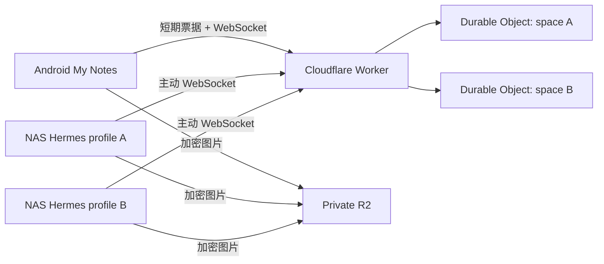

# Hermes Cloudflare Chat 技术方案与部署手册

## 方案结论

家庭 NAS 不开放公网入站端口。每个 Hermes profile 启动自己的 Gateway 和
`cloudflare_chat` 插件，由插件主动连接
`wss://h.superstar1014.qzz.io/api/hermes-chat/ws`。安卓记事本登录现有账号后，
动态读取可用 profile，并用 Telegram 风格的会话列表进入各自的独立聊天。



profile 数量不写死。Worker 从 `HERMES_CHAT_PROFILES` 读取列表，安卓端从 API
动态读取配置。当前实现最多接受 32 个 profile，目的是防止错误配置无限创建
Durable Object。会话列表不会连接所有 profile，也不会从 Cloudflare 拉取全部历史；
只读取各 profile 的本机加密缓存作为摘要，进入具体会话后才连接对应 space。

## 隔离与安全模型

- 每个 profile id 确定性映射到一个 `space:<profileId>` Durable Object，聊天序号、
  离线记录和连接完全隔离。
- 每个 profile 必须使用不同的 32 字节 `HERMES_CF_CHAT_KEY`。文字与图片均由
  Android/NAS 使用 AES-256-GCM 加密，Cloudflare 只保存密文和路由所需元数据。
- NAS profile 可以共用一个 `HERMES_CHAT_AGENT_SECRET` 做 Worker 身份认证；该
  secret 不参与消息加密。
- Android 使用现有登录会话换取 90 秒、单次使用、绑定 profile 的 WebSocket
  票据，长期设备令牌不会放进 WebSocket URL。
- 图片明文上限为 10 MiB。WebSocket 只发送加密描述符，密文二进制放入现有私有
  R2 bucket 的 `hermes-chat/v1/<profileId>/` 前缀。
- Durable Object 保存最近 30 天且最多 500 条加密消息；断线重连按序号补发，每批
  最多 100 条。每天最多一次的 DO alarm 会清理到期消息；没有消息时不运行 alarm。

## 流式回复

Hermes v0.20.1 的 Gateway 会先调用平台适配器 `send()` 创建一条回复，再反复调用
`edit_message(..., finalize=...)` 更新该回复。插件使用首次发送获得的 relay 序号作为
替换目标：中间更新只经 WebSocket 实时广播，不写入 500 条历史；最终更新才持久化，
因此重连仍可恢复完整文本。

更新正文、目标序号与完成标志都在 AES-GCM 密文中；外层只保留 Durable Object
路由所需的目标序号和完成标志。Android 解密后会交叉校验两份元数据，再原地更新
同一个消息气泡。若很旧的原消息已超过保留范围，重放最终更新时会退化为显示一条
完整回复，不会丢失内容。

## Cloudflare 配置

在 `wrangler.jsonc` 中配置所有聊天对象，格式为逗号分隔的 `id:显示名`：

```json
{
  "vars": {
    "HERMES_CHAT_PROFILES": "primary:Hermes 主助手,personal:Hermes 个人助手",
    "HERMES_CHAT_CLOUD_RETENTION_DAYS": "30"
  }
}
```

要求：id 只能包含小写字母、数字、下划线和连字符，最长 64 字符；显示名最长
40 字符；id 发布并产生聊天记录后不要改名。显示名可以随时修改。

`HERMES_CHAT_CLOUD_RETENTION_DAYS` 必须是 1 到 3650 的整数；无效或缺失时按 30 天。
本地缓存保留期限和云端期限相互独立：例如 Android 永久保留时，已缓存到本机的
历史仍可查看，但 Cloudflare 只负责最近 30 天的跨设备恢复。

R2 聊天附件需要一次性添加 prefix lifecycle。附件比消息多保留 1 天，用于消化
Cloudflare lifecycle 的异步执行边界；删除对象本身不收 R2 operation 费用：

```bash
npx wrangler r2 bucket lifecycle add notes hermes-chat-expire hermes-chat/v1/ --expire-days 31
npx wrangler r2 bucket lifecycle list notes
```

不要给整个 `notes` bucket 设置过期规则，否则会误删加密笔记附件。规则必须只匹配
`hermes-chat/v1/`。

首次发布前执行：

```bash
npx wrangler secret put HERMES_CHAT_AGENT_SECRET
npm test
npx wrangler deploy --dry-run
npx wrangler deploy
```

`wrangler.jsonc` 已把 `h.superstar1014.qzz.io` 声明为 Custom Domain。若该主机名
已有 CNAME，需要先在 Cloudflare DNS 中确认并移除冲突记录；Custom Domain 会由
Cloudflare 创建 DNS 记录和证书。

## NAS 多 profile 部署

先查看实际 profile 名称：

```bash
hermes profile list
```

默认 profile 的插件目录：

```text
/root/.hermes/plugins/cloudflare_chat
```

命名 profile（示例 `personal`）的插件目录：

```text
/root/.hermes/profiles/personal/plugins/cloudflare_chat
```

把仓库 `integrations/hermes-cloudflare-chat/cloudflare_chat/` 的完整内容复制到每个
需要聊天能力的 profile。将 `requirements.txt` 安装到运行 `hermes` 的同一个
Python/虚拟环境中；不要在插件目录保存 secret。

每个 profile 都有独立的插件启用配置。复制完成后为 `personal` 单独启用，并授予
适配器注册消息工具所需的 override 权限：

```bash
hermes -p personal plugins enable cloudflare_chat --allow-tool-override
```

`hermes plugins enable ...` 只会修改默认 profile，不能代替上面的 `-p personal`。

默认 profile 的 `/root/.hermes/.env` 示例：

```dotenv
HERMES_CF_RELAY_URL=wss://h.superstar1014.qzz.io/api/hermes-chat/ws
HERMES_CF_AGENT_SECRET=<与 Wrangler Secret 相同>
HERMES_CF_SPACE_ID=primary
HERMES_CF_CHAT_KEY=<Android 中 primary 对象生成的密钥>
HERMES_CF_AGENT_ID=nas-primary
HERMES_CF_ALLOWED_USERS=android-owner
HERMES_CF_ALLOW_ALL_USERS=false
```

新增 `personal` 的 `/root/.hermes/profiles/personal/.env`：

```dotenv
HERMES_CF_RELAY_URL=wss://h.superstar1014.qzz.io/api/hermes-chat/ws
HERMES_CF_AGENT_SECRET=<与 Wrangler Secret 相同>
HERMES_CF_SPACE_ID=personal
HERMES_CF_CHAT_KEY=<Android 中 personal 会话生成的独立密钥>
HERMES_CF_AGENT_ID=nas-personal
HERMES_CF_ALLOWED_USERS=android-owner
HERMES_CF_ALLOW_ALL_USERS=false
```

它与其他 profile 共用 relay URL 和 agent secret，但必须使用独立的
`HERMES_CF_SPACE_ID`、`HERMES_CF_CHAT_KEY` 和 agent id。

重启并检查每个 Gateway：

```bash
hermes gateway restart
hermes -p personal gateway restart
hermes status
hermes -p personal status
```

## Android 使用流程

1. 登录 My Notes，点击底部 `Hermes`。
2. 客户端从 Worker 动态读取全部 profile，并显示各自的本机加密消息摘要。
3. 点击聊天对象进入独立会话；首次进入每个对象时分别生成聊天密钥。
4. 把界面显示的 `HERMES_CF_SPACE_ID` 和密钥写入对应 NAS profile 的 `.env`。
5. 重启对应 Gateway 后发送文字或图片验证。

Android Keystore 按 profile id 独立保护密钥。Android 2.4 起，最近使用的一个 profile
WebSocket 由应用进程持有：返回会话列表或把 App 切到后台不会主动关闭，进程仍存活时
会自动重连；重新进入会话后补写后台收到的消息。进入另一个对象会先关闭旧 profile，
再加载对应缓存和 checkpoint，仍只维持一个 Durable Object 连接，不会混用历史或密钥。
退出登录会立即关闭连接；Android 系统杀死后台进程后，WebSocket 会随进程结束。

### Android 本地聊天缓存

- Android 2.0 起会把每个 profile 的消息快照和最后 durable sequence 写入
  `noBackupFilesDir`。消息快照由对应 `HERMES_CF_CHAT_KEY` 再次使用 AES-GCM
  加密，profile 之间不能互相解密。
- WebSocket 重连使用本地 sequence 作为 `resume.afterSeq`，只补发新消息。清理旧
  消息时仍保留 sequence，因此被清理的历史不会在下次重连时重新下载。
- 流式中间更新只改当前界面，不写本地历史、不推进 checkpoint；最终更新才原子
  替换缓存中的完整正文并推进 sequence。
- 默认保留 30 天，可在聊天右上角设置为 7、30、90 天或永久。系统 JobScheduler
  每 24 小时清理一次，也可手动立即清理当前聊天；清理消息会同步删除无引用的
  加密图片缓存。
- 图片附件在应用私有目录中仍以端到端密文缓存。点击缩略图可打开全屏预览；只有
  点击“保存相册”后，原始图片才会通过 MediaStore 写入 `Pictures/My Notes`。
- Android 2.1 起，输入状态只在“开始/停止输入”变化时发送，避免每个字符产生一个
  Durable Object 入站事件。右上角“清理当前聊天（本机和 Cloudflare）”会二次确认，
  先通过登录会话和 CSRF 清空当前 profile 的 DO 历史及 R2 前缀，再删除本地缓存；
  任何云端步骤失败时都保留本机数据，便于重试。
- 消息气泡左下角显示手机本地时区的发送时间（`yyyy-MM-dd HH:mm`），不再显示
  “Hermes”或“你”；流式生成期间只在时间后追加“正在回复”。
- Android 2.2 起，底部文件夹入口改为 Hermes 会话；文件夹快捷按钮和横向筛选栏
  继续保留。会话列表支持搜索任意数量的已配置 profile，并从本机加密快照显示末条
  消息与时间，不会为列表中的其他 profile 建立 WebSocket。
- Android 2.4 起，聊天页在长 profile 名称和大字体下也会保留独立状态行，始终明确显示
  `WS 已连接/未连接/连接中/已断开`。
  文字或图片成功发送后会立即显示 `正在思考…`，首条 Agent 回复到达后恢复
  加密连接状态；插件 0.1.6 也会在每个 profile 接收消息时 best-effort 上报 typing。

## 成本边界

- Worker WebSocket 仅初始 Upgrade 计一次 Worker request，后续 WebSocket 消息不计
  Worker request；DO 入站消息按 20:1 折算 request。
- Hibernation API 使空闲 WebSocket 不计 DO duration；NAS 的协议级 ping 也不计 DO
  request，因此保留 20 秒 ping 以提高家庭网络长连接稳定性。
- 日常附件清理由 R2 lifecycle 完成，不做每日 ListObjects。只有用户手动立即清理
  时才按当前 profile 分页 List；DeleteObject 免费。
- R2 Standard 每月含 10 GB-month、100 万 Class A 和 1000 万 Class B 免费额度。
  当前聊天量通常远低于此范围；不要切换到没有免费额度且有 30 天最低存储期的
  Infrequent Access。

## 回滚

- Android：安装上一版本 APK；原笔记功能和数据格式未改变。
- NAS：停止对应 Gateway，移走该 profile 下的 `cloudflare_chat` 插件目录，再启动
  Gateway。其他 profile 不受影响。
- Cloudflare：回滚 Worker 版本即可。R2 lifecycle 是 bucket 独立配置，Worker 回滚
  不会自动移除；如需停止附件自动过期，应单独删除 `hermes-chat-expire` 规则。不要
  删除 Durable Object namespace 或 R2 bucket，否则历史密文与图片无法恢复。
