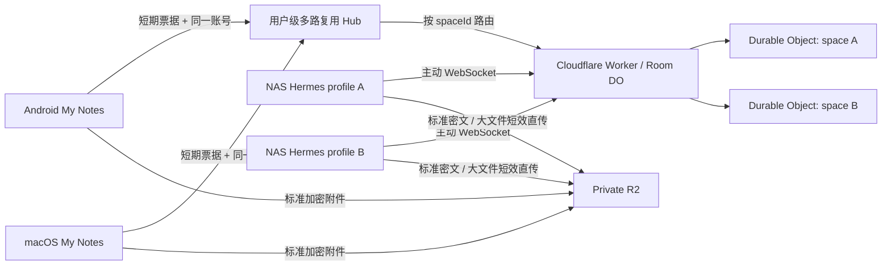

# Hermes Cloudflare Chat 技术方案与部署手册

## 方案结论

家庭 NAS 不开放公网入站端口。每个 Hermes profile 启动自己的 Gateway 和
`cloudflare_chat` 插件，由插件主动连接
`wss://h.superstar1014.qzz.io/api/hermes-chat/ws`。Android 与 macOS 的 My Notes 登录现有
账号后，动态读取可用 profile，并用 Telegram 风格的会话列表进入各自的独立聊天。



profile 数量不写死。Worker 从 `HERMES_CHAT_PROFILES` 读取列表，两个原生客户端从 API
动态读取配置。当前实现最多接受 32 个 profile，目的是防止错误配置无限创建
Durable Object。会话列表不会从 Cloudflare 拉取全部历史，只读取各 profile 的本机
加密缓存作为摘要；每个客户端内的已配置 profile 通过一条进程级复用 WebSocket 按
space id 路由，不会为每个聊天对象分别创建连接。相同账号的 Android 和 Mac 可以同时
连接用户级 Hub；任一客户端发送的 durable 消息都会同步扇出到其他在线客户端。

## 隔离与安全模型

- 每个 profile id 确定性映射到一个 `space:<profileId>` Durable Object，聊天序号、
  离线记录和连接完全隔离。
- 每个 profile 必须使用不同的 32 字节 `HERMES_CF_CHAT_KEY`。文字、操作和 10 MiB
  以内的标准附件由 Android/macOS/NAS 使用 AES-256-GCM 加密，Cloudflare 只保存密文
  和路由所需元数据。
- 只有已认证的 Hermes Agent 能输出超过 10 MiB 的大附件，默认上限 512 MiB。文件名、
  类型、大小、SHA-256 和消息描述符仍在 AES-GCM 消息内；大文件对象本身不使用聊天密钥
  加密，但 R2 bucket 保持私有，客户端只能通过 Worker 签发的短期对象 GET 下载。
- R2 S3 永久凭据只保存在 Worker secret。NAS 只获得绑定随机对象 UUID、有限时长且不可
  覆盖已有对象的 PUT URL；Android/macOS 不具备上传大附件的权限。
- NAS profile 可以共用一个 `HERMES_CHAT_AGENT_SECRET` 做 Worker 身份认证；该
  secret 不参与消息加密。
- 原生客户端使用现有登录会话换取 90 秒、单次使用、绑定 profile 集合的 WebSocket
  票据，长期凭据不会放进 WebSocket URL。
- WebSocket 只发送加密描述符；新旧附件对象都放入现有私有 R2 bucket 的
  `hermes-chat/v1/<profileId>/` 前缀，因此单条删除、profile 清理和 lifecycle 同时覆盖。
- Durable Object 保存最近 30 天且最多 500 条加密消息；断线重连按序号补发，每批
  最多 100 条。每天最多一次的 DO alarm 会清理到期消息；没有消息时不运行 alarm。

## 流式回复

Hermes v0.20.1 的 Gateway 会先调用平台适配器 `send()` 创建一条回复，再反复调用
`edit_message(..., finalize=...)` 更新该回复。插件使用首次发送获得的 relay 序号作为
替换目标：中间更新只经 WebSocket 实时广播，不写入 500 条历史；最终更新才持久化，
因此重连仍可恢复完整文本。

更新正文、目标序号与完成标志都在 AES-GCM 密文中；外层只保留 Durable Object
路由所需的目标序号和完成标志。Android 解密后会交叉校验两份元数据，再原地更新
同一个消息气泡。若很旧的原消息已超过保留范围，重放最终更新时会退化为显示一条
完整回复，不会丢失内容。

## Cloudflare 配置

在 `wrangler.jsonc` 中配置所有聊天对象，格式为逗号分隔的 `id:显示名`：

```json
{
  "vars": {
    "HERMES_CHAT_PROFILES": "primary:Hermes 主助手,personal:Hermes 个人助手",
    "HERMES_CHAT_CLOUD_RETENTION_DAYS": "30",
    "HERMES_CHAT_R2_ACCOUNT_ID": "<Cloudflare Account ID>",
    "HERMES_CHAT_R2_BUCKET_NAME": "notes",
    "HERMES_CHAT_AGENT_ATTACHMENT_MAX_BYTES": "536870912",
    "HERMES_CHAT_R2_UPLOAD_TICKET_TTL_SECONDS": "1800",
    "HERMES_CHAT_R2_DOWNLOAD_TICKET_TTL_SECONDS": "900"
  }
}
```

要求：id 只能包含小写字母、数字、下划线和连字符，最长 64 字符；显示名最长
40 字符；id 发布并产生聊天记录后不要改名。显示名可以随时修改。

`HERMES_CHAT_CLOUD_RETENTION_DAYS` 必须是 1 到 3650 的整数；无效或缺失时按 30 天。
本地缓存保留期限和云端期限相互独立：例如 Android 永久保留时，已缓存到本机的
历史仍可查看，但 Cloudflare 只负责最近 30 天的跨设备恢复。

R2 聊天附件需要一次性添加 prefix lifecycle。附件比消息多保留 1 天，用于消化
Cloudflare lifecycle 的异步执行边界；删除对象本身不收 R2 operation 费用：

```bash
npx wrangler r2 bucket lifecycle add notes hermes-chat-expire hermes-chat/v1/ --expire-days 31
npx wrangler r2 bucket lifecycle list notes
```

不要给整个 `notes` bucket 设置过期规则，否则会误删加密笔记附件。规则必须只匹配
`hermes-chat/v1/`。

### Hermes Agent 大附件的 R2 凭据

在 Cloudflare Dashboard 的 R2 API Tokens 页面创建专用 Token：权限选择 Object Read &
Write，资源只允许 `notes` bucket。不要复用全账号管理 Token。Account ID 是非敏感部署
变量，写入 `wrangler.jsonc`；把页面生成的 Access Key ID 和 Secret Access Key 只写入
Worker secret：

```bash
npx wrangler secret put HERMES_CHAT_R2_ACCESS_KEY_ID
npx wrangler secret put HERMES_CHAT_R2_SECRET_ACCESS_KEY
```

Worker 使用这些值签发对象级 PUT/GET；凭据不会返回给 NAS 或客户端。Access Key ID 和
Secret Access Key 只在创建时完整显示，应保存在密码管理器，不要写进 `.dev.vars`、
`.env`、`wrangler.jsonc` 或 Git。官方说明：
<https://developers.cloudflare.com/r2/api/tokens/>、
<https://developers.cloudflare.com/r2/api/s3/presigned-urls/>。

首次发布前执行：

```bash
npx wrangler secret put HERMES_CHAT_AGENT_SECRET
npx wrangler secret put HERMES_CHAT_R2_ACCESS_KEY_ID
npx wrangler secret put HERMES_CHAT_R2_SECRET_ACCESS_KEY
npm test
npx wrangler deploy --dry-run
npx wrangler deploy
```

`wrangler.jsonc` 已把 `h.superstar1014.qzz.io` 声明为 Custom Domain。若该主机名
已有 CNAME，需要先在 Cloudflare DNS 中确认并移除冲突记录；Custom Domain 会由
Cloudflare 创建 DNS 记录和证书。

## NAS 多 profile 部署

先查看实际 profile 名称：

```bash
hermes profile list
```

默认 profile 的插件目录：

```text
/root/.hermes/plugins/cloudflare_chat
```

命名 profile（示例 `personal`）的插件目录：

```text
/root/.hermes/profiles/personal/plugins/cloudflare_chat
```

把仓库 `integrations/hermes-cloudflare-chat/cloudflare_chat/` 的完整内容复制到每个
需要聊天能力的 profile。将 `requirements.txt` 安装到运行 `hermes` 的同一个
Python/虚拟环境中；不要在插件目录保存 secret。

每个 profile 都有独立的插件启用配置。复制完成后为 `personal` 单独启用，并授予
适配器注册消息工具所需的 override 权限：

```bash
hermes -p personal plugins enable cloudflare_chat --allow-tool-override
```

`hermes plugins enable ...` 只会修改默认 profile，不能代替上面的 `-p personal`。

默认 profile 的 `/root/.hermes/.env` 示例：

```dotenv
HERMES_CF_RELAY_URL=wss://h.superstar1014.qzz.io/api/hermes-chat/ws
HERMES_CF_AGENT_SECRET=<与 Wrangler Secret 相同>
HERMES_CF_SPACE_ID=primary
HERMES_CF_CHAT_KEY=<Android/macOS 中 primary 对象使用的同一密钥>
HERMES_CF_AGENT_ID=nas-primary
HERMES_CF_ALLOWED_USERS=android-owner
HERMES_CF_ALLOW_ALL_USERS=false
# 可选：与 Worker 上限一致或更低，默认 512 MiB
HERMES_CF_AGENT_ATTACHMENT_MAX_BYTES=536870912
# 可选：大文件 PUT 读取超时秒数，默认 900
HERMES_CF_DIRECT_UPLOAD_TIMEOUT_SECONDS=900
```

新增 `personal` 的 `/root/.hermes/profiles/personal/.env`：

```dotenv
HERMES_CF_RELAY_URL=wss://h.superstar1014.qzz.io/api/hermes-chat/ws
HERMES_CF_AGENT_SECRET=<与 Wrangler Secret 相同>
HERMES_CF_SPACE_ID=personal
HERMES_CF_CHAT_KEY=<Android/macOS 中 personal 会话使用的同一独立密钥>
HERMES_CF_AGENT_ID=nas-personal
HERMES_CF_ALLOWED_USERS=android-owner
HERMES_CF_ALLOW_ALL_USERS=false
HERMES_CF_AGENT_ATTACHMENT_MAX_BYTES=536870912
HERMES_CF_DIRECT_UPLOAD_TIMEOUT_SECONDS=900
```

它与其他 profile 共用 relay URL 和 agent secret，但必须使用独立的
`HERMES_CF_SPACE_ID`、`HERMES_CF_CHAT_KEY` 和 agent id。

重启并检查每个 Gateway：

```bash
hermes gateway restart
hermes -p personal gateway restart
hermes status
hermes -p personal status
```

### 多 profile 定时任务投递

插件 0.1.8 注册了 Hermes 的 `standalone_sender_fn`。`hermes cron run` 即使运行在
Gateway 之外的 CLI 进程中，也会通过一次经过 agent secret 鉴权的 HTTPS 请求投递
密文消息；它不会新建第二条 Agent WebSocket，也不会挤掉正在运行的 Gateway 连接。

定时任务属于各自的 Hermes profile，必须在对应 profile 下管理。每个 profile 的
`deliver=cloudflare_chat` 会解析到该 profile 的 `HERMES_CF_SPACE_ID`：

```bash
# 默认 profile -> HERMES_CF_SPACE_ID=primary -> 主助手会话
hermes cron edit <默认任务ID> --deliver cloudflare_chat
hermes cron run <默认任务ID>

# personal profile -> HERMES_CF_SPACE_ID=personal -> 个人助手会话
hermes -p personal cron edit <个人任务ID> --deliver cloudflare_chat
hermes -p personal cron run <个人任务ID>
```

不要用默认 profile 的聊天密钥向 `personal` 交叉投递；插件会拒绝 `chat_id` 与当前
`HERMES_CF_SPACE_ID` 不一致的请求。以后新增 profile 时，只需为其使用唯一的 space id、
聊天密钥和 agent id，并在 Worker 的 `HERMES_CHAT_PROFILES` 中加入对应 space。

## Android 使用流程

1. 登录 My Notes，点击底部 `Hermes`。
2. 客户端从 Worker 动态读取全部 profile，并显示各自的本机加密消息摘要。
3. 点击聊天对象进入独立会话；首次进入每个对象时分别生成聊天密钥。
4. 把界面显示的 `HERMES_CF_SPACE_ID` 和密钥写入对应 NAS profile 的 `.env`。
5. 重启对应 Gateway 后发送文字或附件验证。

Android Keystore 按 profile id 独立保护密钥。Android 2.14 起，全部已配置 profile
共享一条进程级路由 WebSocket：返回会话列表、切换 App 内页面或把 App 切到后台都不会
主动关闭。后台期间由 `remoteMessaging` 前台服务复用同一连接，并显示低优先级常驻
通知；进程存活时断线会自动重连，重新进入会话后补写后台收到的消息。退出登录会立即
停止服务并关闭连接；Android 系统杀死后台进程后 WebSocket 随进程结束，服务不会自行
拉起 App。

### Android 本地聊天缓存

- Android 2.0 起会把每个 profile 的消息快照和最后 durable sequence 写入
  `noBackupFilesDir`。消息快照由对应 `HERMES_CF_CHAT_KEY` 再次使用 AES-GCM
  加密，profile 之间不能互相解密。
- WebSocket 重连使用本地 sequence 作为 `resume.afterSeq`，只补发新消息。清理旧
  消息时仍保留 sequence，因此被清理的历史不会在下次重连时重新下载。
- 流式中间更新只改当前界面，不写本地历史、不推进 checkpoint；最终更新才原子
  替换缓存中的完整正文并推进 sequence。
- 默认保留 30 天，可在聊天右上角设置为 7、30、90 天或永久。系统 JobScheduler
  每 24 小时清理一次，也可手动立即清理当前聊天；清理消息会同步删除无引用的
  加密附件缓存。
- 附件在应用私有目录中仍以端到端密文缓存。点击图片缩略图可打开全屏预览；只有
  点击“保存相册”后，原始图片才会通过 MediaStore 写入 `Pictures/My Notes`。
- Android 2.16 起，Agent 大附件按需流式下载到 `noBackupFilesDir`，核对长度和 SHA-256
  后才能播放、分享或保存；这些大文件对象未使用聊天密钥加密，本机缓存为权限隔离的
  明文文件。标准附件仍只缓存 AES-GCM 密文。删除消息、profile 清理和保留期清理会同时
  清理两类本机缓存及对应的 R2 对象。
- Android 2.1 起，输入状态只在“开始/停止输入”变化时发送，避免每个字符产生一个
  Durable Object 入站事件。右上角“清理当前聊天（本机和 Cloudflare）”会二次确认，
  先通过登录会话和 CSRF 清空当前 profile 的 DO 历史及 R2 前缀，再删除本地缓存；
  任何云端步骤失败时都保留本机数据，便于重试。
- 消息气泡左下角显示手机本地时区的发送时间（`yyyy-MM-dd HH:mm`），不再显示
  “Hermes”或“你”；流式生成期间只在时间后追加“正在回复”。
- Android 2.2 起，底部文件夹入口改为 Hermes 会话；文件夹快捷按钮和横向筛选栏
  继续保留。会话列表从本机加密快照显示任意数量 profile 的末条消息与时间，不会
  提供服务器搜索或拉取全量历史；多个 profile 统一走同一条路由 WebSocket。
- Android 2.4 起，聊天页在长 profile 名称和大字体下也会保留独立状态行，始终明确显示
  `WS 已连接/未连接/连接中/已断开`。
  文字或附件成功发送后会立即显示 `正在思考…`，首条 Agent 回复到达后恢复
  加密连接状态；插件 0.1.6 也会在每个 profile 接收消息时 best-effort 上报 typing。
- Android 2.5 起，聊天正文按 Telegram 风格渲染标题、粗体、斜体、删除线、行内代码
  和 fenced code block；会话进入、附件选择返回以及收到 Agent 消息后，输入焦点都会
  回到输入框。图片、音频、视频、文档、Office、压缩包、EPUB/APK/IPA 均可双向传输，
  非图片附件通过 Android 系统文件选择器保存。音频使用原生播放控件，视频使用全屏
  播放器；只有点击播放时才解密到 App 私有临时缓存，关闭播放器或销毁页面后立即删除。
- 长按任意已由服务器确认的消息会进入选择模式，可一次选择 1 到 100 条并永久删除。
  Android 先删除 Durable Object 中的目标消息及关联流式最终更新，再按精确 R2 key
  删除所选消息的附件；云端成功后才删除本机加密快照和附件缓存。此操作不会使用
  R2 ListObjects，也不会撤回 Hermes 已经吸收到 NAS Agent 当前上下文中的内容。
- Android 2.6 起，输入框左侧的斜杠按钮可打开 Hermes 快捷指令面板；直接在输入框
  键入斜杠也会显示最多 6 条即时建议。内置目录只收录官方 Slash Commands Reference
  标记为 Messaging 的指令，不混入 quit、browser、config 等终端专用命令。
  model、sessions、reasoning、goal 等带参数指令提供分步选项或参数输入，最终都只
  填入输入框，不会自动发送；new、stop、restart、update、yolo 等会额外显示风险提示。
  使用 /commands 可查询当前 NAS 版本实际注册的指令、已安装 skills 和 quick_commands，
  因此无需修改 Cloudflare 协议或保存指令目录。官方参考：
  <https://hermes-agent.nousresearch.com/docs/reference/slash-commands/>。
- Android 2.15 与插件 0.2.0 起，`/model` 会显示“提供商 → 模型”的原位分页按钮，
  `/reasoning`、`/fast` 等有限选项指令会显示单层按钮。危险命令授权使用“仅本次 / 本会话 /
  始终允许 / 拒绝”，Slash Command 二次确认使用“仅本次批准 / 始终批准 / 取消”，
  `clarify` 的候选回答也可直接点选或改为文字回答。选中项带 `✓`，危险及持久授权使用
  独立颜色和整行按钮，按钮触控区不小于 48dp。
- 交互提示的正文、按钮和处理结果都在原有 AES-GCM 密文中；Cloudflare 只路由密文。
  点击回调走同一条多 profile WebSocket，并按 `spaceId` 投递给对应 Gateway，不作为聊天
  消息写入 Durable Object。NAS 端使用 Hermes 官方 resolver/callback 在同一 Gateway
  进程内完成操作，再用 durable final edit 原位替换提示，因此重连后能看到最终状态。
  升级顺序为 Worker → 每个 profile 的插件 0.2.0 并重启 Gateway → Android 2.15。
  Gateway 重启前尚未处理的按钮会失效，重新发送原指令即可。
  适配器能力、授权边界与指令定义以 Hermes 官方文档为准：
  <https://hermes-agent.nousresearch.com/docs/developer-guide/adding-platform-adapters>、
  <https://hermes-agent.nousresearch.com/docs/user-guide/security/>、
  <https://hermes-agent.nousresearch.com/docs/reference/slash-commands>。

## macOS 使用流程

1. 安装并登录最新版 `My Notes.app`，在左侧“工作区”选择 `Hermes 聊天`。
2. 客户端从同一 Worker 动态读取 profile；进入钥匙设置，为每个 profile 粘贴 Android
   已在使用的对应聊天密钥。不要重新生成不同密钥，也不要把密钥写进源码或文档。
3. 密钥只保存到 macOS Keychain；消息快照保存在 Application Support 并再次使用该
   profile 的聊天密钥加密。标准附件缓存只保存 R2 返回的密文；Agent 大附件按需流式
   下载，校验 SHA-256 后以权限 `0600` 保存在该 profile 的私有缓存中。
4. 已配置的所有 profile 共用一条 macOS 进程级多路复用 WebSocket。切换笔记页面或把
   窗口放到后台不会主动断开；退出账号或进程结束时才关闭。
5. Android 与 macOS 使用同一登录账号、同一 profile chat key 即可同时在线。任一端发送
   的消息先持久化到对应 Room DO，再由用户级 Hub 同步到同账号的其他在线终端；断线端
   之后按 durable sequence 增量补发，不会重新下载全部历史。
6. Mac 的 Hermes 消息输入框使用回车发送、`Shift+回车` 换行，也保留 `⌘+回车` 发送。
   中文输入法选词时，回车只确认候选词，不会发送消息。

macOS 与 Android 的当前能力基线记录在
`docs/hermes-native-client-capabilities.json`。后续新增 Hermes 聊天能力时必须同时更新
Android、macOS、必要的 Worker/插件协议、该能力清单以及 `npm test` 中的跨端一致性测试；
只修改一个客户端不视为功能完成。

### 原生客户端附件白名单

| 类别 | 扩展名 |
|---|---|
| 图片 | `png jpg jpeg gif webp bmp tif tiff svg` |
| 音频 | `mp3 wav ogg m4a opus flac aac` |
| 视频 | `mp4 mov webm mkv avi` |
| 文档 | `pdf txt md csv json xml html yaml yml log` |
| Office | `doc docx xls xlsx ppt pptx odt ods odp` |
| 压缩包 | `zip rar 7z tar gz bz2` |
| 电子书/安装包 | `epub apk ipa`（仅传输和保存，不自动执行） |

插件 0.1.8 对应实现 Hermes 的 `send_document`、`send_file`、`send_voice` 和
`send_video`，入站音频/视频分别映射为 `VOICE`/`VIDEO`，其他非图片附件映射为
`DOCUMENT`。附件传输沿用现有通用密文 R2 端点，不需要更换环境变量或聊天密钥；
Android 2.5 的单条/多条消息删除需要同时部署本版本 Worker，新增的登录态 API 会
精确删除 Durable Object 消息和对应 R2 对象。

插件 0.3.0、Android 2.16 与 macOS 1.8 起，Agent 输出在 10 MiB 以内继续走上述
AES-GCM 通用端点；超过 10 MiB 时由插件先流式计算 SHA-256，再用 Worker 签发的短效
对象 PUT 直传并完成 HEAD 校验，成功后才发送加密消息描述符。首版采用单 PUT，默认
512 MiB 上限，不实现 Multipart。客户端仍不能上传超过 10 MiB 的文件。

插件 0.3.3 在 Hermes 完成回复时显式发送
`typing active=false, terminal=true`。配套 Worker 会在每个 profile Room DO 实例内复用
同一用户 Hub 的 RPC stub，并按 Hub 串行 RPC 调用，保证最终回复和紧随其后的停止输入
状态按调用顺序到达；只有 RPC 本身失败或确认过期注册已不存在时才淘汰 stub，
并发刷新过的注册会保留其 stub。stub
缓存和发送队列不放进 `blockConcurrencyWhile`，DO 初始化锁仍只执行本地 SQL，不跨
Durable Object 做外部 I/O。

插件侧还会为每条已接收入站消息推进独立的 typing epoch，并在入站边界先发送
`active=false, terminal=false` 清除上一 turn 的残留输入态，但不结束客户端刚建立的本次
等待状态。只有当前 turn 创建的 `_keep_typing` task 才能
重新发送 `active=true`；正常 turn 和级联处理的排队消息都会由自己的 task 点亮并最终
关闭状态，而 `/new`、`/reset` 等不启动新 task 的旁路会保持关闭。有效的 `stop_typing`
会先关闭当前 epoch，再发送 `active=false`；旧 task 即使因 Hermes 上游生命周期边缘情况
没有被取消，它后续的心跳和 finally 清理也不会复活输入状态或误清新 turn。关闭状态
不会消耗新的 epoch id，因此首次 `active=false` 发送失败时，Hermes 基类仍可在同一 turn
重试；一旦有新入站推进 epoch，旧 retry 立即失效。Hermes 将多条排队 text/media 合并进
existing pending event 或 queue-mode text debounce 的 `state.event` 时，插件会只把该对象
更新到最新 epoch；独立的旧 event 即使延迟调度，仍保留原 epoch，不能偷领新 turn。
对 runner 原任务内直接取出的下一条队列消息，会把当前 owner task 重绑到新 epoch；
活跃会话的内联指令以及 approval/clarify 恢复也只重绑最新的 owner/heartbeat task，
活跃会话中的 `/new`/`/reset` 会在中断旧 owner 后为新请求显式发送 terminal stop。

部署本版本 Worker、替换每个 profile 的插件并重启 Gateway；环境变量和聊天密钥不变。
Android 2.21 与 macOS 1.15 起会区分上述 fence 与 terminal；旧插件省略 `terminal` 的
`active=false` 仍按 terminal 处理以保持兼容，并同时保留短期 typing 超时，防御断线等
无法送达停止帧的情况。

插件 0.3.2 在每次创建危险命令授权消息时，从当前 Hermes profile 的
`approvals.timeout` 动态读取有效期；配置缺失、格式错误或暂时无法读取时，回退到
Hermes 默认的 300 秒。这样 Hermes 的 fail-closed 等待、加密按钮的 `expiresAt` 和
插件主动更新“已过期”的时间保持一致，主 profile 与命名 profile 可以分别配置。
该版本只需替换每个 profile 的插件并重启对应 Gateway，不需要修改环境变量、部署
Worker 或升级 Android/macOS 客户端。

插件 0.3.1 保持 Hermes 默认 300 秒的 fail-closed 授权期限。无人操作时，插件会在
到期点主动将原交互消息更新为“已过期”；macOS 也会按 `expiresAt` 自动禁用按钮，
并在发送 action 前再校验一次。普通出站消息如果丢失 WebSocket 应用层 ACK，插件会
淘汰旧连接，再用完全相同的加密消息 ID 走已有 HTTPS 端点幂等确认，不会产生
第二条可见消息。该版本不需要修改环境变量、密钥或重新部署 Worker。

## 成本边界

- Worker WebSocket 仅初始 Upgrade 计一次 Worker request，后续 WebSocket 消息不计
  Worker request；DO 入站消息按 20:1 折算 request。
- Hibernation API 使空闲 WebSocket 不计 DO duration；NAS 的协议级 ping 也不计 DO
  request，因此保留 20 秒 ping 以提高家庭网络长连接稳定性。
- 日常附件清理由 R2 lifecycle 完成，不做每日 ListObjects。只有用户手动立即清理
  时才按当前 profile 分页 List；DeleteObject 免费。
- R2 Standard 每月含 10 GB-month、100 万 Class A 和 1000 万 Class B 免费额度。
  当前聊天量通常远低于此范围；不要切换到没有免费额度且有 30 天最低存储期的
  Infrequent Access。

## 回滚

- Android：安装上一版本 APK；原笔记功能和数据格式未改变。
- NAS：停止对应 Gateway，移走该 profile 下的 `cloudflare_chat` 插件目录，再启动
  Gateway。其他 profile 不受影响。
- Cloudflare：回滚 Worker 版本即可。R2 lifecycle 是 bucket 独立配置，Worker 回滚
  不会自动移除；如需停止附件自动过期，应单独删除 `hermes-chat-expire` 规则。不要
  删除 Durable Object namespace 或 R2 bucket，否则历史密文与附件无法恢复。
